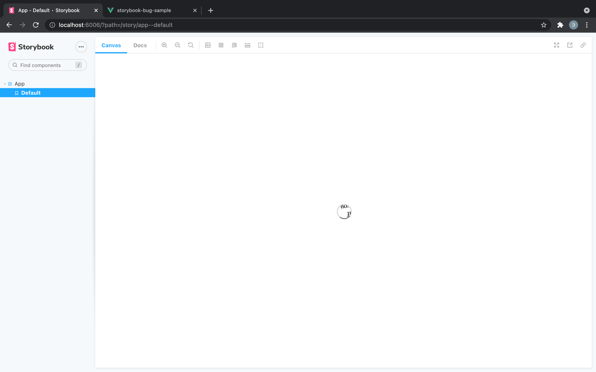

# Storybook's own styles are overwriting my component styles
Issue link: https://github.com/storybookjs/storybook/issues/16545

## Steps to reproduce
1. Clone this repository
    ```shell
    git clone git@github.com:ed-asriyan/storybook-bug-sample.git
    cd storybook-bug-sample
    ```
2. Install dependencies
    ```shell
    npm ci
    ```
3. Serve the app
    ```shell
    npm run server
    ```
4. Open `http://localhost:8080`. Make sure, that you see this text: `if you see this text the .loader element is rendered correctly`
    
5. Run storybook and open `App` component in it
    ```shell
    npm run storybook
    ```

## Actual result
There is Storybook's loader inside `App` component:


The loader has the text inside:


## Expected result
`if you see this text the .loader element is rendered correctly` text is displayed inside `App` story
